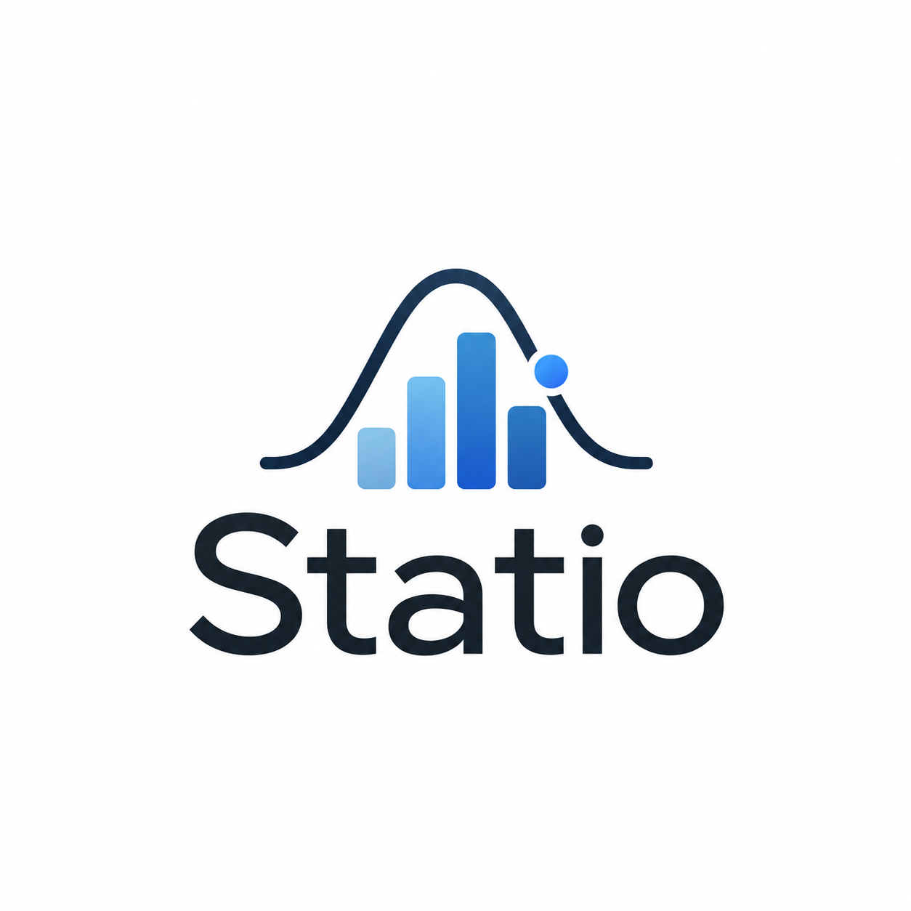

# Statio
<p align="center">
  
</p>

<h1 align="center">Statio</h1>

<p align="center">
  Where Statistics Makes Sense.
</p>
### Where Statistics Makes Sense.

Statio is an open-source Python library focused on making statistical analysis simple, understandable, and convenient for data scientists, ML engineers, AI engineers, researchers, and students.

> Less code. More statistical insight.

---

## 🚧 Project Status

Statio is currently under active development.

The project is being built from the ground up with a focus on:

- Statistical correctness
- Simple and intuitive APIs
- Clear mathematical reasoning
- Useful diagnostics
- Developer-friendly design
- Easy-to-understand documentation

---

## Current Progress

Statio is currently under active development.

### Descriptive Statistics

- [x] Mean
- [x] Median
- [x] Mode
- [x] Variance
- [ ] Standard Deviation
- [ ] Range
- [ ] Quartiles
- [ ] Percentile
- [ ] IQR
- [ ] Z-Score

Each implemented function is developed with:
- Mathematical definition and reasoning
- Explicit input and output contracts
- Edge-case handling
- Invalid-input validation
- Automated tests
- Documentation

## 🎯 Vision

Statio aims to make statistical analysis easier to perform and easier to understand.

Instead of requiring users to repeatedly implement common statistical calculations, Statio will provide simple, reliable interfaces for statistical operations.

The long-term goal is to create a statistics-first toolkit that helps users not only **calculate statistics**, but also **understand what those statistics mean**.

---

## ✨ Planned Features

### Descriptive Statistics

- Mean
- Median
- Mode
- Variance
- Standard deviation
- Range
- Quartiles
- Percentiles
- Interquartile range (IQR)
- Z-score

### Probability

Planned probability-related functionality will be developed after the initial descriptive statistics foundation.

### Inferential Statistics

Planned functionality includes statistical tests and methods for drawing conclusions from data.

### Statistical Diagnostics

Statio will provide statistical diagnostics that can help identify issues and patterns in datasets.

### Statistical Recommendations

The library will eventually be able to recommend appropriate statistical methods based on the characteristics of a dataset and analysis problem.

---

## 🐍 Example

The goal of Statio is to make statistical operations as simple as:

```python
from statio.descriptive.mean import mean
from statio.descriptive.median import median
from statio.descriptive.mode import mode

data = [10, 20, 20, 30, 40]

print(mean(data))
print(median(data))
print(mode(data))


## Why Statio?

Statio is designed to make statistical analysis simple, readable, and accessible.

The goal is to provide clear statistical functions with sensible handling of
edge cases, useful errors, and an easy-to-understand API.